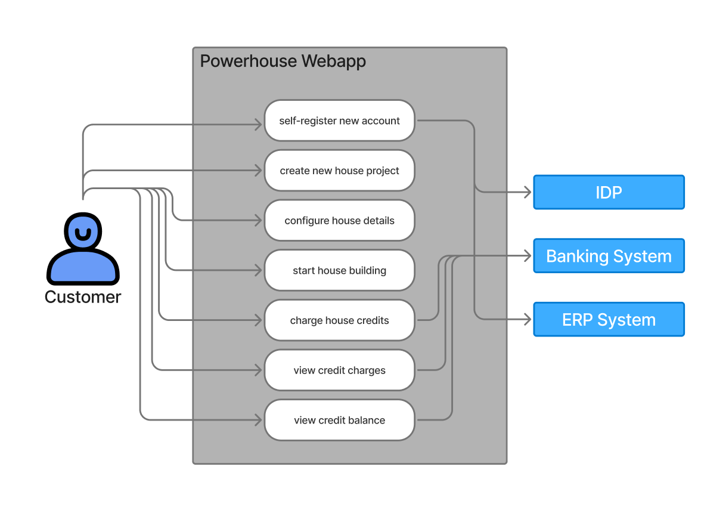

# System Behavior (Use Cases)

## Use Case Diagram

Primary Actors:
- Customers

Use Cases:
- self-register new account
- create new house project
- configure house details
- start house building
- charge house credits
- view credit charges
- view credit balance

Secondary Actors:
- IDP
- Banking System
- ERP System

## Use Case Narrative: Place Order

### Use Case Name
- view credit charges

### Primary Actor
Customer

### Goal
The customer adds funds to their project budget.

### Preconditions
- The customer is registered and logged into the system.
- The Banking System is available.

### Main Success Scenario
1. The customer selects the project they want to add funds to.
2. The customer selects the amount of money they want to fund.
3. The customer is redirected to the banking website where they enter the Credit Card details
4. The customer is redirected to the Power House Web app with a success confimation screen
5. The System adds the funded amount as virtual credits to the selected Project.

### Extensions (Alternative Flows)
- 3a. Credit Card Limit:
    - The Credit Card limit is not high enough to finish teh transaction
    - The customer is redirected the Power House Web app with a rejection screen showing a helpful message on how to change your credit card limit.

### Postconditions
- The project credit balance is increased by the funded amount