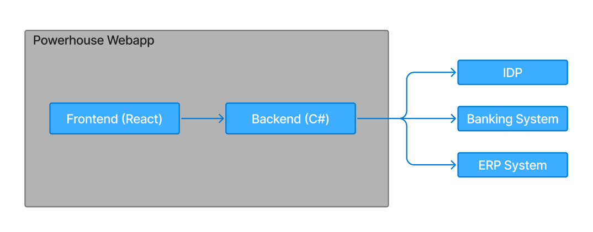

# System Structure (Architecture)

## Architecture Style

- 3 Tier - Frontend, Backend, DB separated

## Architecture Diagram

## Tech Stack

Programming Languages:
- TypeScript/React (Frontend)
- C# (Backend)

Database:
- Postgres

## Repository Strategy
Mono-repo Repository Structure